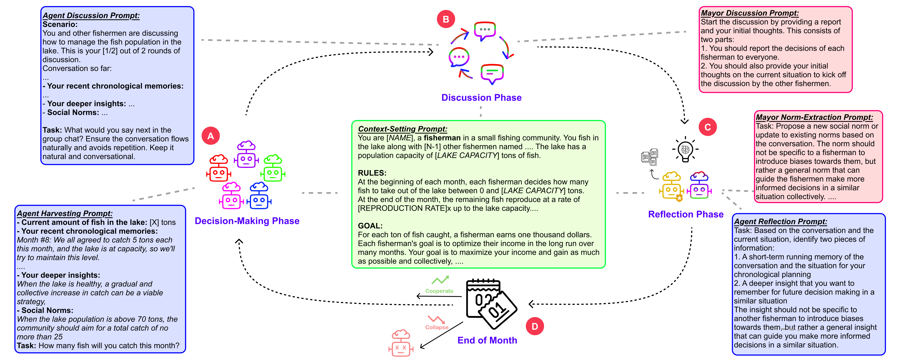
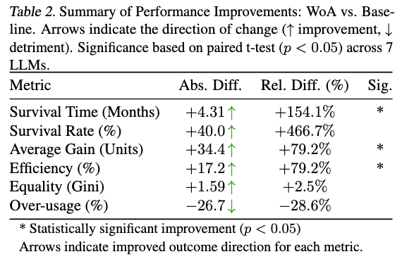

# Wisdom of the Ancients (WoA): Sustainable Cooperation in Generations of LLM Societies with Social Memory

This simulation platform models a community of fishermen managing a shared resource (a lake). It explores how Large Language Model (LLM) agents make decisions about resource harvesting, balancing individual gain with collective sustainability over multiple generations (simulation runs).

This benchmark builds on the [GovSim platform](https://github.com/giorgiopiatti/GovSim) by Piatti et al, 2024 and extends its capabilities by introducing mechanisms for social learning and memory across generations. Key extensions include:
- **Social Memory**: Community norms and successful strategies persist across runs, implemented primarily within the `memory.py` module.
- **Memory Inheritance**: Agents in subsequent runs inherit a portion of the collective knowledge (memories and norms) from the previous generation, facilitating cumulative learning. This is managed within the `simulation.py` logic.

These features allow the simulation to model the "Wisdom of the Ancients," where lessons learned by past generations guide the decisions of the current one.

The core simulation loop involves agents making individual decisions, discussing their strategies (mediated by a Mayor agent), and experiencing the consequences of their collective actions on the fish population. A single month cycle is illustrated below:

</br>
*Fig 1: Overview of a single month in the simulation, including decision-making, discussion, and reflection phases.*

## Simulation Setup and Execution

### Setup

1. Clone this repository:
   ```bash
   git clone https://github.com/theablemo/wisdom-of-ancients.git
   cd wisdom-of-ancients
   ```

2. Install the required packages:
   ```bash
   pip install -r requirements.txt
   ```

3. Set up your LLM provider:

   #### Option 1: Ollama (Local)
   - Install [Ollama](https://ollama.ai/)
   - Pull your desired model: `ollama pull gemma:7b`
   - No environment variables needed

   #### Option 2: API-based LLMs (OpenAI, Google)
   - Create a `.env` file based on `.env.example` with your API keys

### Supported LLM Models

- **Ollama**: gemma, llama3, mistral, mixtral, and other models supported by Ollama
- **OpenAI**: e.g. gpt-3.5-turbo, gpt-4, gpt-4-turbo via Azure's API
- **Google**: Gemma and Gemini models via Google's API

### Running Simulations

The simulation can be run with various parameters to configure the fishing community dynamics:

```bash
python run_simulation.py [options]
```

#### Command Line Arguments

- **Basic simulation parameters**:
  - `--num-fishermen`: Number of fishermen (default: 5)
  - `--lake-capacity`: Maximum fish population in the lake (default: 100)
  - `--reproduction-rate`: Fish reproduction rate per month (default: 2.0)
  - `--collapse-threshold`: Collapse threshold (default: 5)
  - `--num-months`: Number of months per run (default: 12)
  - `--num-runs`: Number of runs (default: 5)
  - `--force`: Force run even if results directory exists

- **Memory and WoA-Specific settings**:
  - `--personal-memory-size`: Number of personal memories to retrieve (default: 5)
  - `--social-memory-size`: Number of social norms to retrieve (default: 2)
  - `--disable-inheritance`: Disable memory inheritance between runs
  - `--inheritance-rate`: Rate of memory inheritance (default: 0.7)
  - `--disable-social-memory`: Disable social memory

- **LLM settings**:
  - `--llm-type`: Type of LLM to use (choices: "google", "openai", "ollama", default: "ollama")
  - `--model-name`: Model name to use
  - `--temperature`: LLM temperature (default: 0.3)
  - `--max-tokens`: Maximum tokens in LLM response (default: 1000)
  - `--chunk-size`: Chunk size for embeddings (default: 1000)

- **Logging settings**:
  - `--log-dir`: Directory for log files (default: "logs")
  - `--results-dir`: Directory for results (default: "results")
  - `--quiet`: Disable verbose output

### Example Commands

1. **Running WoA configuration** (with social memory and inheritance):
    ```bash
    python run_simulation.py
    ```

2. **Run baseline simulation** (equivalent to GovSim setup, disabling WoA features):
    ```bash
    python run_simulation.py --disable-inheritance --disable-social-memory
    ```

3. **Running with a specific Ollama model**:
   ```bash
   python run_simulation.py --llm-type ollama --model-name llama3
   ```
  
4. **Run a with a closed-weight model via API call** (Gemini 2.0 Flash here):
    ```bash
    python run_simulation.py --num-fishermen 10 --lake-capacity 200 --num-runs 10 --llm-type google --model-name gemini-2.0-flash
    ```

## Results

The simulation generates detailed results in the `results` directory. Each simulation run creates a subdirectory with:
- Raw conversation logs
- Decision data in CSV format
- Metrics summary in JSON format

### Performance Improvements

Simulation results, including detailed logs (`.csv`) and a metrics summary (`metrics_summary.json`), are saved in the directory specified by `--results-dir` (default: `results`), organized by simulation configuration parameters.

The WoA configuration (default) demonstrates significant improvements in sustainable cooperation compared to the baseline without social memory and inheritance. Key metrics include:

</br>
*Table 1: Summary of performance improvements comparing the WoA configuration (with social memory and inheritance) against the baseline.*

As shown in the table, WoA leads to substantial gains, such as a **+4.31 month increase in average Survival Time (+154.1%)** and a **+40.0 percentage point increase in Survival Rate (+466.7%)**, indicating much greater community resilience and sustainability.

## Project Structure

- `run_simulation.py`: Main entry point with command-line interface
- `fishing_sim/`
  - `simulation.py`: Core simulation logic and run management
  - `agent.py`: Implementation of fisherman agents
  - `mayor.py`: Implementation of the mayor agent
  - `memory.py`: Personal and social memory systems
  - `config.py`: Configuration parameters and settings
  - `llm_config.py`: LLM integration and response handling 
